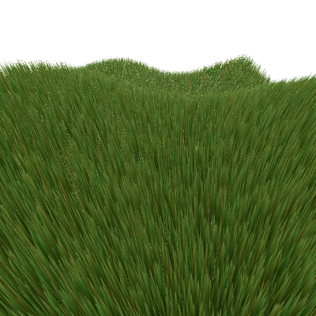
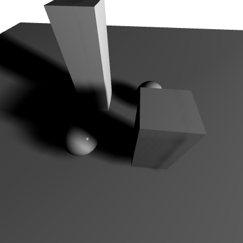
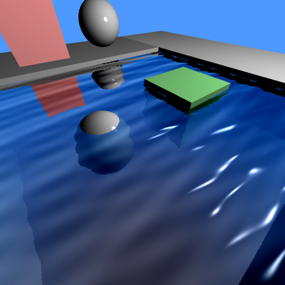
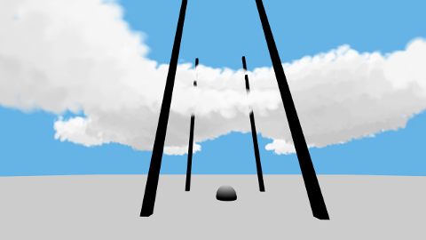

# OpenGL examples

     

This is a list of examples done a few years ago after taking a computer graphic course to better understand opengl and apply some of the techniques read in the litterature.

Content of the repo:

- Triangle: hello world program, tests the display and the buffers
- Rotating cube: Add movement in the scene and transormation matrices
- Texture plane: Tests textures, both from an image and generated
- Sphere light: Different lightings on a sphere: Flat Goureaud and Phong with interacitvity to select the lighting type
- Terrain camera: A terrain generated with a Perlin noise in which we can navigate with either a free moving camera or a FPS-style one
- Bumpmapping: Simulates bumps on a flat surface using random Perlin noise and pixel shader
- Framebuffer: Displays the scene in a framebuffer, allowing post processing effects: gaussian blur, edge detection, etc.
- LOD Terrain: Implementation of a perlin noise terrain with simple CPU LOD implementation (using quad tree), which is dynamically updated with camera position
- Shadow mapping: Implementation of a dynamic shadow mapping using a depth buffer from the point of view of the light, smoothing techniques are applied on the shadow to make it less pixelated
- Ambient occlusion: Deferred SSAO algorithm done in the shaders which give depth in a scene, a few different algorithms are implemented
- Grass: Display 100k individual grass elements using instanced drawing and geometry shaders and make them move in the wind with a perlin noise
- Water: Reflects objects on a water surface with waves distorting the reflexion
- Sky: Displays a moving sun on a sky-sphere
- Particles: A simple particles system using instanced drawing
- Tree: Procedural generation of realistic trees using L-System
- Atmospheric scattering: implemented in a similar way as in the [GPU Gems 2 book](https://developer.nvidia.com/gpugems/GPUGems2/gpugems2_chapter16.html)
- Volumetric clouds: using combination of 3d and 2d noises and particles

## How to build
All these examples are made to run on a moderately powerful laptop (Intel HD Graphics 620 Intel core i7-7500U 8GB Ram)

There were compiled on a Linux Mint 18.1, the needed libraries are the following:

- glfw2 2.7.9
- glew 1.13.0
- devIl 1.7.8

Create a `build` folder in the example you want to build, then from the `build` folder, `cmake ..` to populate it and `make` to build the example
