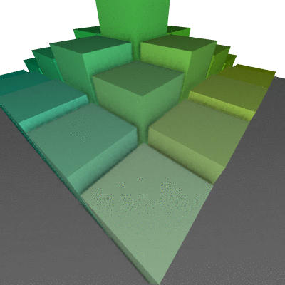

# Ambient Occlusion

This is an implementation of the SSAO algorithm (screen space ambient occlusion) which is done deferred from other processing in a AO shader.

The SSAO is done for each pixel, using a depth buffer, rays are sent from the given pixel randomly on a short distance, if the ray intercepts
an object, the current pixel will be darker, if not, it won't be shadowed. This has the goal to give edges and corners a darker look which give
a sensation of depth in the scene. A few dozen of these rays/samples have to be averaged to give a decent AO effect. A few additional processing
were evaluated.

This implementation use a random vector depending on the pixel position in the screen (avoid giving a random vector from the cpp).

The algorithm finds positions of pixels from the depth buffer in the 3d world using the inverse perspective matrix. Rays are then casted from
this 3d points randomly on a short distance, the resulting vector is then transformed back into a depth using the perspective matrix,
if is the depth value is roughly the same as the depth buffer, it hasn't gone through an object. The number of rays interescting object
give the amount of AO for this pixel.

Due to the random nature of the algorithm, a post processing gaussian blur is applied on the AO to avoid having noise (which would have to be
mitigated by a lot of sampling).

In order to improve the visual quality without using too many samples, it is possible to add a few techiniques:
- use a distribution to concentrate the rays near the origin
- send the rays on an hemisphere on the normal of the pixel instead of a sphere (this needs a normal framebuffer). This is really the best for surfaces
because sphere sampling will give a normal value centered on 0.5, whereas hemisphere should give an AO value of 0.

# Controls

- WASD: moves the camera
- IJKL: change camera view direction
- E: is no SSAO to see how dull the scene looks
- R: is SSAO without randomisation, which gives "stripes" and glitches
- T: is SSAO with randomisation
- Z: is SSAO with randomisation and a smart distribution which concentrate samples around the origin of the sampling sphere
- U: is SSAO with rand. but using an hemisphere instead of a sphere, allowing to have better results on surfaces
