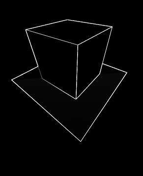
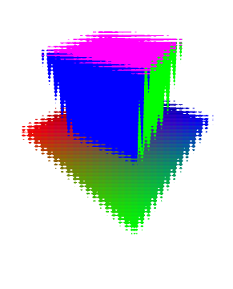
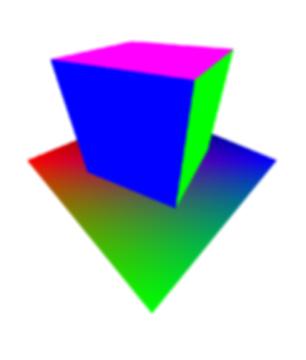

# Framebuffer

 

Instead of drawing the scene directly on the opengl viewport, we can draw it on a framebuffer, which can be used as
a texture, to be drawn on a quad that takes the whole view port. This has a few advantages.

Multisampling (anti aliasing) can be done, by drawing on multiple sample per pixel and then averaging them.

Effect can be done on the rendered image itself. In this example, gaussian blur is implemented by convoluting the pixels with a gaussian matrix.
Another implemented effect is an edge detection using a sobel operator.

These effects take place in the pixel shader of the "screen quad" containing the framebuffer as a texture, so they are really optimized for parallel computation.

These effects are all done in post processing, that is after the scene is rendered.

# Controls

- WASD: moves the camera
- IJKL: change camera view direction
- 0: no effects
- 1: inverted colours
- 2: small gaussian blur
- 3: medium gaussian blur
- 4: big gaussian blur
- 5: edge detection (sobel convolution)
- 6: broken glass
