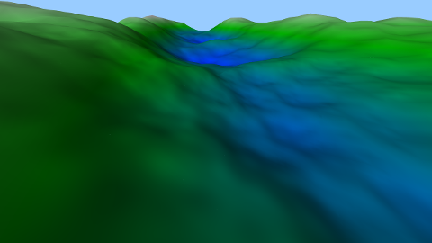

# LOD Terrain

 

LOD (Level Of Detail) allow to have a huge procedural terrain without too many triangles, by having the polygons near
the camera at high detail, and the far away ones with a lower level of details, this saves a high amount of triangls without
sacrificing the visual quality.

The terrain is subdivided into squares, that are ordered in a structure called a quad tree. The squares that are
near the root will be bigger and coarser.
As the camera moves, new squares will be added or removed from the tree.

This is one of the most simple implementation of LOD, one of its biggest drawback is that
the change of LOD happens instantly, it is as such very visible.

Another problem of this implementation is that it is done in CPU. A lot of cpu ressources are
used for the calculation of the LOD.

# Controls

- WASD: moves the camera
- IJKL: change camera view direction
- M/N: activate and deactivate fps/free camera (default: free)
- B/V: activate/deactivate moving light (simulate VERY roughly sun) (default: activated)
- C/X: activate/deactivate wireframe to see the lod in action (deflaut: deactivated)
