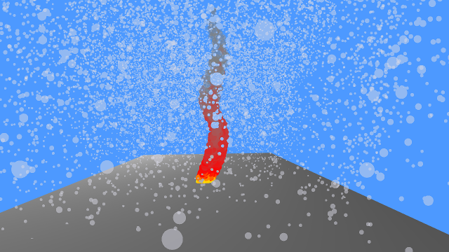

# Particles

This is a fairly simple implementation of a particle system done in opengl.

The particles are generated and updated on the cpu, and drawn with instanced draw calls. The shape of the particle is defined one time and buffers for the positions and age of particles are updated and sent to the gpu every draw cycle.

The particles contain their age, time to live, 3d position, initial velocity, and an additional 3d wind function can be applied on the particle.

The obvious drawback of this system is that it will have lots of cpu-gpu communication.

On a (Intel HD Graphics 620 Intel core i7-7500U 8GB Ram) computer, it can handle ~100K particles at a good framerate as long as particles are small enough, otherwise the fillrate of the gpu wont be enough. From 200K and up, the data transfer kills the framerate.

# Controls
- WASD: moves the camera
- IJKL: change camera view direction
