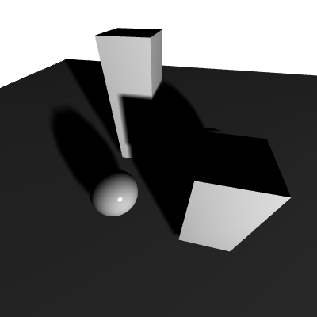

# Shadow mapping

 

This is a simple and straightforward implementation of shadow mapping in opengl

The scene is rendered from the point of view of the light, only the depth is rendered. This result is saved in a depth only framebuffer.
The framebuffer is then passed to the real scene being rendered, in the pixel shaders. Each pixel calculate its position but respective to the light instead
of the camera, it then calculates its distance to the camera and compares it to the texture.

To know the distance between the point and the light, the MVP (well, the V and P) are passed to the shader to calculate the screen position
of the fragment from the point of view of the light.

To find the position of the fragment on the depth texture (the shadow map) there needs to be a transform as the MVP*vertex gives the position
in screen coord [-1. 1] whereas the texture map is [0, 1]

If the texture is of a small size (which it is in the demo to accentuate the effect), there will be pretty big aliasing effects on the shadow
To solve this there are a few techniques:

- bilinearly interpolate the shadow map
- PCF: instead of testing if the fragment is in this pixel of the shadow map, test the pixels around and do an average.

This techniques can produce interesting effects (see the 7x7 matrix PCF) but is costly (7x7 = 35 shadow map read per pixel)

# Controls

- WASD: moves the camera
- IJKL: change camera view direction
- VBNM: Chose different positions of light (moving dynamic light and fixed)
- Shadow map types:
   - E: no shadow mapping
   - R: shadow mapping without processing: the raw shadow map is drawn, square pixels will appear
   - T: The shadow maps pixels are lineary interpolated, making the shadow "smoother"
   - Z: PCF without bilinear interpolation (3x3 PCF matrix)
   - U: PCF with bilinear interpolation (3x3 PCF matrix)
   - F: PCF with bilinear interpolation (7x7 PCF matrix)
   - G: optimized PCF with bilinear interpolation (3x3 PCF matrix)
