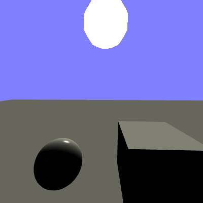
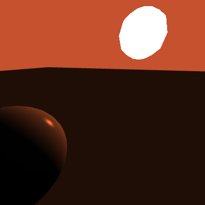

# Sky

 

This is a simple sky/sun implementation in the same idea of a sky box, instead a sphere is used here.
The sun is drawn on the skysphere without the use of any textures, and the colour of the sun is reflected in the environment.
At sunset, in addition to the sky becoming red, the objects on the scene also take the colour of the sky.

Not using any texture and drawing the sun in a shader has the advantage to be more flexible and faster

# Controls

- WASD: moves the camera
- IJKL: change camera view direction
- VBNM: change light position
- T: make the sun move (default)
- Z: stop the sun
