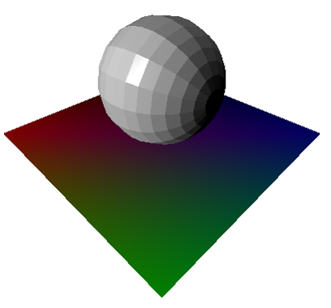
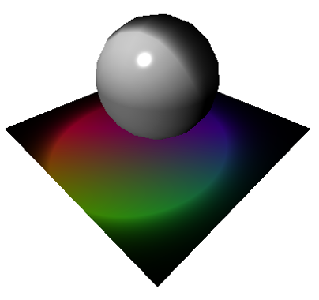

# Sphere lighting

 

The goal of this example is to implement a simple lighting model in opengl.

A sphere is used in the middle of the scene in order to demonstrate the various lighting

Multiple lighting models are implemented:
- Flat: one normal per surface
- Per vertex or Goureaud: one normal per vertex, calculation done in the vertex shader, the lighting is then interpolated for each pixel
- Per pixel or Phong: Normals are interpolated for each pixel then the shading is calculated for each pixel, better visual result but more calculations needed

Both the diffuse and specular lighting are calculated and both point light and spots are implemented and can be activated in the controls

# controls
- 0: flat lighting (default)
- 1: vertex lighting (goureaud)
- 2: pixel lighting (phong)
- A: deactivate specular shading
- S: activate specular shading (default)
- Q: deactivate spotlight
- W: activate spotlight (default)
- Y: light going up and down (default)
- X: light rotating above sphere
