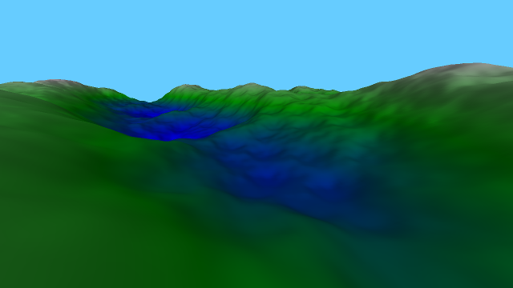
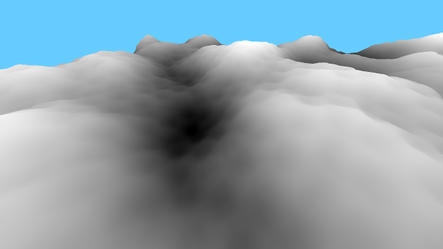

# Terrain camera

 

This example is an implementation of a procedural terrain using a Perlin noise in which we can move using a free-moving camera or a FPS-style camera

The terrain is generated using a perlin noise which provides a natural look, the noise is generated using an additive noise funcition with a fractional
amplitude each loop.

The noise generation is done in the CPU, as such it isn't the fastest (4sec needed for the generation on a i7 laptop).

In addition to the heightmap, the normals for the terrain are also generated using the same perlin noise, this allows a specular lighting to be used.

Other evaluated noise functions were linear, which is fast but gives ugly results, and the ease function with random values, which gives a smooth results, less natural than Perlin but with less calculations. Perlin stays very slow, and could be accelerated by being implemented on the GPU or using some sort of LOD to not load a precise noise function with lots of loops in far away polygons.

# Controls

- WASD: move the camera position
- IJKL: move the camera orientation
- M: free camera
- N: fps camera, stuck to the ground (default)
- B/V: activate/deactivate moving light (default is not moving)
- Y/X: activate/deactivate colour (default is colour)
- T/Z: activate/deactivate heighmap: draw terrain pixel depending on their height (default is not drawn)
