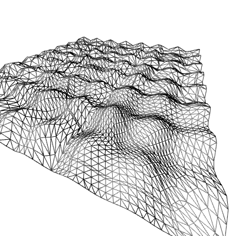

# Tessellation shader

Requires OpenGL 4.0

This example shows 18 triangles arranged in a flat plane. The height of the verice is calculated from sines, `sin(x)+sin(z)`.
Without tessellation, the surface will appear very flat, however using the tessellation shader, intermediate veroces will appear between the triangles according to a tessellation level.

Two levels of the tessellation shader are used, the Tessellation Control Shader (TCS) is used to calculate the tessellation level for the edges.
The Tessellation Evaluation Shader (TES), acts as a vertex shader but for the resulting tessellated vertices. The vertex shader is only used for the control points, that is original vertices of the shape before the tessellation.

The tessellation level is calculated as the inverse of the distance between the camera and the verices. Moving the camera around will change the tessellation level the closer it is to a geometry, the more detailed it will be.

# Controls
- WASD: moves the camera
- IJKL: change camera view direction
- N/M: Wireframe ON/OFF
- 1-9: Have a fixed tessellation level
- 0: Use inverse of distance as tessellation level
