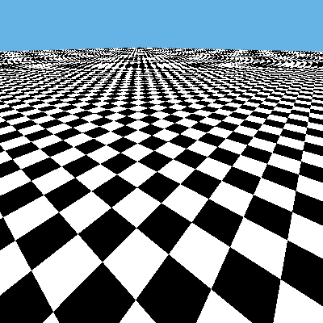

# Texture filtering

Shows some different texture filtering on a classical checkerboard texture to show how aliasing can be mitigated at the expense of more processing.

| GL_NEAREST | GL_NEAREST_MIPMAP_NEAREST |
| ------ | ----------- |
|    |   |

| GL_NEAREST_MIPMAP_LINEAR | Anisotropic 8.0f |
| --------- | ---------- |
|  |  |

Point filtering is the simplest to compute, each pixel on screen will correspond to the nearest pixel on the texture, but will cause some aliasing artifacts in the distance when the object is moving   
Using Mipmaps solves the problem of aliasing by having multiple sizes of the same texture in memory which will be displayed at a distance, in the case of the checkerboard texture this causes a blur.   
Using the `GL_LINEAR_MIPMAP_LINEAR` fitering allows opengl to interpolate between the mipmap levels avoiding visible bands between the different levels.   
Anisotropic filtering will allow some clever and costly computation within opengl to take into account the position of the camera and the angle of the texture to fix both the aliasing and the blur.

# Controls
- WASD: moves the camera
- IJKL: change camera view direction
- X: GL_NEAREST as texture filtering, will take
- C: GL_LINEAR, does bilinear interpolation on the texture
- V: GL_LINEAR_MIPMAP_NEAREST, will use mipmap in the distance
- B: GL_LINEAR_MIPMAP_LINEAR, will use mipmap in the distance but will interpolate between the mipmap levels (trilinear filtering)
- 1: anisotropic filtering value 1
- 2: anisotropic filtering value 2
- 3: anisotropic filtering value 4
- 4: anisotropic filtering value 8
- N/M: activates or stops the rotation of the textured surface
