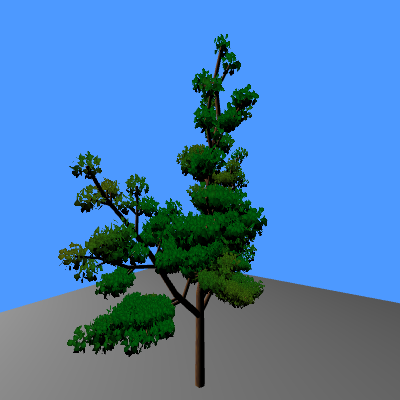
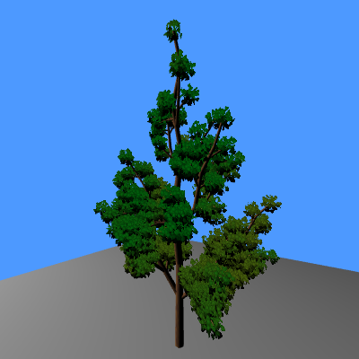
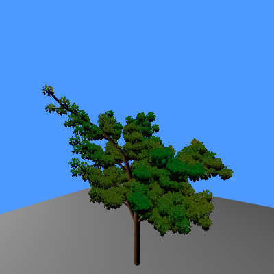
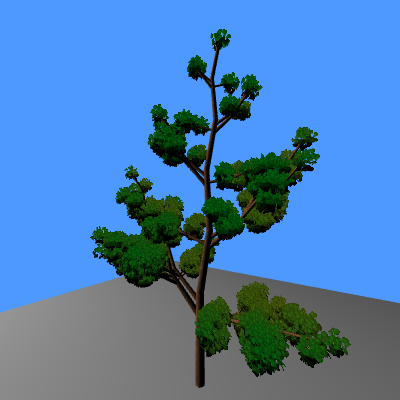

# Tree procedural generation using L-System

Procedural generation of trees using L-Systems.

The trunks are made of cylinder with some sort of simplified brown perlin noise as texture.

Leaves are added on the tips of the branches, they are a bunch of green triangles whose corners has been smoothed by the fragment shader.

The leaves are added as small spheres of these triangle shapes and the ones that are on the bottom of the sphere are darker in colour to give
a sense of shadow and depth.

 

 

# Controls
- WASD: moves the camera
- IJKL: change camera view direction
- R: Generate a new tree
