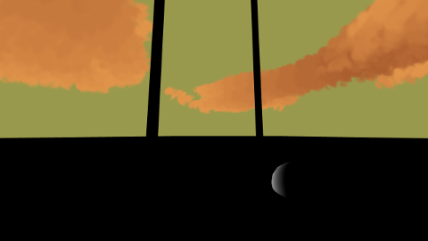

# Volumetric clouds

Volumetric clouds using semi transparent particles and 3d noise generation.

The particles are placed in a volume above the ground given the 3d noise generation.
If the values in the noise are above a variable threshold the particle will be placed.

The particles are 2d squares panes. To give even more depth, a 2d noise is used as a transparent mask
on the particle, a random value is used to shift the position of the alpha mask on the 2d noise.

Depth testing is deactivated during the particles drawing, to avoid problems with the transparency.
This means that the particles have to be drawn in order of the furthest to the nearest to the camera.
Sorting is done to know this order. Since the sorting is pretty costly but isn't necessary for all frames, it
is done in a separated thread, to avoid lowering the framerate.

Shading the clouds is done by integrating on the ray from the particle to the sun.
The particle will be more or less dark depending if the ray interestects a lot of clouds (using the 3d noise).

# Controls
- WASD: moves the camera
- IJKL: change camera view direction
- MN: more or less clouds
- X: midday sun
- C: evening sun
