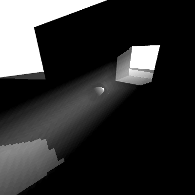
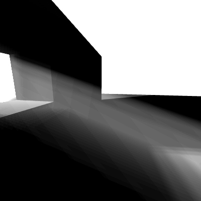

# Volumetric light

 

Extending the shadow map example to add some post processing volumetric light.

Implementation inspired from: https://developer.nvidia.com/gpugems/gpugems3/part-ii-light-and-shadows/chapter-13-volumetric-light-scattering-post-process

The implementation is using rays going away from the camera, until it has reached the depth of the scene (and thus we hit a displayed object).
At each step, we will check if the 3d point is viewed from the light, using a depth buffer generated from the point of view of light. When applying the projection matrix to the 3d point on the ray, we can compare the depth of the point to the depth buffer and finding out if the point is visible from the light. If it is the case we increase the value of the pixel, thus giving the volumetric light effect.

Generating rays from the 2d pixels of the camera quad is explained here: https://www.scratchapixel.com/lessons/3d-basic-rendering/ray-tracing-generating-camera-rays/generating-camera-rays

There should be some balancing between the number of steps in the ray, the distance between each steps and the resolution of the post-processing light to keep acceptable performance and good visual quality. 

# Controls

- WASD: moves the camera
- IJKL: change camera view direction
- VBNM: Chose different positions of light (moving dynamic light and fixed)
- ERTYUFG: Shadow map types
