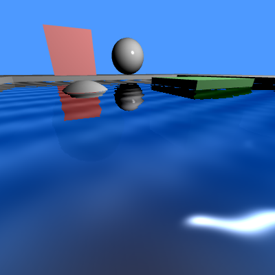

# Water

 

Water is simulated as a plane on which shaders use various framebuffers to display refractions and reflexions.

Waves are done with addition of sine waves, normals are calculated for each pixel of the water in the pixel shader
in order to display the specular lighting.

Reflexion is done with a flipped camera, which displays the scene upside down in a framebuffer, while discarding everything underwater.
When displaying the water, the reflexion is displayed as a texture and ripples are created by shifting the texture lookup by the amount of wave

Refraction is done the same way as the reflexion, but the camera isn't flipped. A framebuffer containing the objects underwater is displayed
on the water plane and ripples displayed in a similar manner.

Whether the reflexion or the refraction framebuffer will be displayed depends on the angle formed between the camera and the water.
If the angle is near 0 (camera on the surface of the water), only reflexion will be displayed, if the angle is 90 (camera looking down),
only stuff underwater will be shown, this is a very rough estimation on how water behaves.

A depth buffer is also used to find if an object is more or less underwater, and alter its colour depending on the depth, but this wasn't very successful.

The water display is pretty costly, needing multiple drawing steps in buffers, a simplification could be to use only the reflexion framebuffer and the
result would be good enough.

# Controls
- WASD: moves the camera
- IJKL: change camera view direction
- ERTZ: various water effects (more or less waves)
- VBNM: change light position
